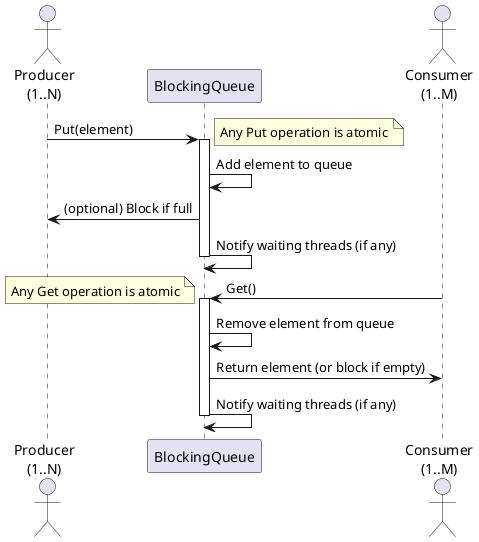

# Software Unit Design Specification (SWUD)

**Unit Name:** BlockingQueue  
**Version:** 1.0  
**Author:** Michel Charpentier (spec), adapted for SWUD by [Markus A. Kuppe]  
**Date:** [2025-06-17]

---

## 1. Purpose and Scope
The `BlockingQueue` software unit models a thread-safe, bounded FIFO queue supporting multiple producers and consumers. It ensures that producers block when the queue is full and consumers block when the queue is empty.

---

## 2. Interfaces

| Name        | Type      | Direction | Description                                      |
|-------------|-----------|-----------|--------------------------------------------------|
| Producers   | Set       | Input     | Set of producer thread identifiers               |
| Consumers   | Set       | Input     | Set of consumer thread identifiers               |
| QCapacity   | Integer   | Input     | Maximum number of elements in the queue          |

---

## 3. Functional Description

- **Initialization:**
  - The queue is empty and no threads are waiting.

- **Producer Operation (`Put`):**
  - If the queue is not full, a producer appends data to the queue and notifies a waiting thread (if any).
  - If the queue is full, the producer is added to the waiting set.

- **Consumer Operation (`Get`):**
  - If the queue is not empty, a consumer removes the head of the queue and notifies a waiting thread (if any).
  - If the queue is empty, the consumer is added to the waiting set.

- **Thread Notification:**
  - When a thread completes an operation, it may notify (wake) one waiting thread.

---

## Internal State (for Reference)

- **queue**: Sequence representing the current contents of the queue. Used internally to store elements added by producers and removed by consumers.

---

## 4. Safety and Security Aspects

- **Safety:**
  - The queue never exceeds `QCapacity`.
  - No data is lost or duplicated.
  - No thread is both a producer and a consumer.
  - Only non-empty producer and consumer sets are allowed.

- **Security:**
  - Not applicable for this abstract model.

---

## 5. Sequence Diagram

The following PlantUML sequence diagram illustrates a producer adding an element to the BlockingQueue and a consumer removing an element:

---

## 6. Assumptions and Limitations

- The sets `Producers` and `Consumers` are non-empty and disjoint.
- `QCapacity` is a natural number.
- The model abstracts away actual data values and thread scheduling; all possible execution orders (interleavings) of producer and consumer actions are considered.
- No explicit error handling for invalid operations.

---

## 7. Traceability to Requirements

| Requirement ID | Description                                                        | SWUD Section   |
|----------------|--------------------------------------------------------------------|----------------|
| REQ-1          | Bounded queue with blocking semantics                             | 1, 3, 4        |
| REQ-2          | Multiple producers and consumers supported                         | 1, 2, 3        |
| REQ-3          | No data loss or duplication                                        | 4              |
| REQ-4          | The queue capacity shall be configurable at initialization.        | 1, 2, 6        |
| REQ-5          | The queue shall not allow insertion of elements when full.          | 3, 4, 6        |
| REQ-6          | The queue shall not allow removal of elements when empty.           | 3, 4, 6        |
| REQ-7          | The unit shall not permit a thread to act as both producer and consumer. | 2, 4, 6   |
| REQ-8          | The unit shall support concurrent access by multiple producers and consumers. | 1, 2, 3, 4 |
| REQ-9          | The unit shall not leak memory or resources during operation.       | 4, 6           |
| REQ-10         | The unit shall provide blocking semantics for both producers and consumers. | 1, 3, 4 |
| REQ-11         | The sets of producers and consumers shall be fixed for the lifetime of the queue. | 2, 6 |
