# BlockingQueue
Tutorial-style talk "Weeks of debugging can save you hours of TLA+".  The inspiration  for this tutorial and definitive background reading material (with spoilers) is ["An Example of Debugging Java with a Model Checker
"](http://www.cs.unh.edu/~charpov/programming-tlabuffer.html) by [Michel Charpentier](http://www.cs.unh.edu/~charpov/).  I believe it all goes back to [Challenge 14](http://wiki.c2.com/?ExtremeProgrammingChallengeFourteen) of the c2 wiki.

Each [git commit](https://github.com/lemmy/BlockingQueue/commits/tutorial) introduces a new TLA+ concept.  Go back to the very first commit to follow along!  Please note - especially when you create PRs -that the git history will be rewritten frequently to stay linear.

Click either one of the buttons to launch a zero-install IDE to give the TLA+ specification language a try:

[](https://github.com/codespaces/new?hide_repo_select=true&ref=main&repo=220093229)
[](https://gitpod.io/#https://github.com/lemmy/BlockingQueue)

This tutorial is work in progress. More chapters will be added in the future. In the meantime, feel free to open issues with questions, clarifications, and recommendations. You can also reach out to me on [twitter](https://twitter.com/lemmster).  Basic TLA+ learning material can be found over at [Lamport's TLA+ page](http://lamport.azurewebsites.net/tla/learning.html).

--------------------------------------------------------------------------

### v24 (Refinement): Prove refinement mapping of BlockingQueueSplit.

Below, TLC checked the refinement mapping for a finite model/particular configuration, which gives for ```BlockingQueueSplit``` sufficient confidence that the refinement mapping is correct.  The fact that the refinement mapping is straight forward indicates that a TLAPS prove is likely straight forward too. So let's give in to the academic in us and prove the correctness of the refinement mapping.  To prove that ```BlockingQueueSplit``` implements ```BlockingQueue```, we first prove ```TypeInv``` inductive with the now know invariance proof rule.  Once we have proven this LEMMA, we reuse it and the [proof rule for refinement (section 4.2)](https://members.loria.fr/SMerz/papers/tla+logic2008.pdf) to prove ```THEOREM Implements == Spec => A!Spec```.

### v23 (Refinement): Refine BlockingQueue with BlockingQueueSplit.

The specs ```BlockingQueueSplit.tla``` and ```BlockingQueue.tla``` look almost identical, except ```BlockingQueueSplit.tla``` has one more variable and slightly different definitions for ```Put```, ```Get```, ```Wait```, and ```NotifyOther```.  However, there is no (logical) connection between the two specs, albeit spec ```BlockingQueueSplit``` can be considered an implementation of ```BlockingQueue```. 

This is where TLA's [secret power](https://news.ycombinator.com/item?id=21669689) comes into play. In an earlier step, we wrote ```THEOREM DeadlockFreedom == Spec => []Invariant``` to state that ```BlockingQueue``` satisfies ```[]Invariant``` where ```[]Invariant``` was a (safety) property.  However, TLA does not distinguish between properties and (machine) specs; both are "just" formulas.  This power means that we may also say that the spec defined in ```BlockingQueueSplit``` satisfies/implements the machine spec ```BlockingQueue``` by stating ```THEOREM Implements == Spec => BlockingQueue!Spec```.  

We are almost done. However, since ```BlockingQueueSplit``` differs slightly from ```BlockingQueue```, we have to provide a [refinement mapping](https://lamport.azurewebsites.net/tla/hiding-and-refinement.pdf) that relates the low-level spec to the high-level spec. In the case of ```BlockingQueueSplit```, it is fortunately straight forward: the union of ```waitC``` and ```waitP``` maps to ```waitSet```.

We can verify the correctness of the refinement mapping (for a finite model) with TLC again.  This time though, TLC does not check an invariant (state formula) but the (temporal) property ```BlockingQueue!Spec```.

Sidenote: "TLA" above is *not* a typo! Read Lamport's [The Temporal Logic of Actions](https://lamport.azurewebsites.net/pubs/lamport-actions.pdf) to understand why.

### v22 (Refinement): Create BlockingQueueSplit with two sets waitP and waitC.

The bugfix below exploited the power of ([Zermelo-Fraenkel](https://en.wikipedia.org/wiki/Zermelo%E2%80%93Fraenkel_set_theory)) set theory to get away without changing ```waitSet``` into two (disjoint) sets; one for waiting ```Producers``` and one for waiting ```Consumers``` (we will call them ```waitP``` and ```waitC``` respectively).  In a real-world program, however, the elegance of math is likely too inefficient which is why a program would indeed maintain ```waitP``` and ```waitP``` to avoid intersecting ```Producers``` and ```Consumers``` from ```waitSet``` over and over again (which probably allocates temporary memory too).  In an actual project, we would probably spend no more than a few minutes on analyzing if separating ```waitSet``` into ```waitP``` and ```waitC``` can introduce a deadlock again.  Here, we have the luxury of time and thus write a new spec ```BlockingQueueSplit.tla```.  Fortunately, most of ```BlockingQueueSplit.tla``` is identical to ```BlockingQueue.tla``` which is why we copy&paste from ```BlockingQueue``` before we modify ```NotifyOther```.

### v21 (Traces): Validate long executions against the spec.

The previous step showed that trace validation is probabilistic and has no guarantees of finding violations of the high-level spec.  Thus, we want to increase the chance by checking a long or many traces.  However, copying long traces into the spec is not only a nuisance, but also slows down [SANY](https://github.com/tlaplus/tlaplus/issues/413#issuecomment-571024785).  This step introduces how to [serialize the app's output](./impl/src/org/kuppe/App2TLA.java) in a format that TLC can de-serialize efficiently with the help of the [IOUtils module](https://github.com/tlaplus/CommunityModules/blob/master/modules/IOUtils.tla).

```bash
java -XX:StartFlightRecording=disk=true,dumponexit=true,filename=app-$(date +%s).jfr -cp impl/src/ org.kuppe.App

# Kill the process after a while.

# app-XXXXXXX.jfr is the flight recording created by the previous command.
# app-XXXXXXX.bin is the serialized app output.
java -cp tla2tools.jar:impl/src/ org.kuppe.App2TLA app-XXXXXXX.jfr app-$(date +%s).bin
```

With the longer trace (note the change in ```BlockingQueueTrace.tla```), we are lucky and TLC finds a violation:

```tla
$ java -cp /opt/TLA+Toolbox/tla2tools.jar:CommunityModules.jar tlc2.TLC BlockingQueueTrace
TLC2 Version 2.15 of Day Month 20?? (rev: 52e91aa)
Warning: Please run the Java VM which executes TLC with a throughput optimized garbage collector by passing the "-XX:+UseParallelGC" property.
(Use the -nowarning option to disable this warning.)
Running breadth-first search Model-Checking with fp 10 and seed -2300318498630499187 with 1 worker on 4 cores with 5964MB heap and 64MB offheap memory [pid: 32602] (Linux 4.18.0-16-generic amd64, Azul Systems, Inc. 11.0.6 x86_64, MSBDiskFPSet, DiskStateQueue).
Parsing file /home/markus/src/TLA/_specs/models/tutorials/BlockingQueueTLA/BlockingQueueTrace.tla
Parsing file /tmp/TLC.tla
Parsing file /tmp/Sequences.tla
Parsing file /tmp/Naturals.tla
Parsing file /tmp/FiniteSets.tla
Parsing file /tmp/IOUtils.tla
Parsing file /home/markus/src/TLA/_specs/models/tutorials/BlockingQueueTLA/BlockingQueue.tla
Parsing file /home/markus/src/TLA/_specs/models/tutorials/BlockingQueueTLA/TLAPS.tla
Semantic processing of module Naturals
Semantic processing of module Sequences
Semantic processing of module FiniteSets
Semantic processing of module TLC
Semantic processing of module IOUtils
Semantic processing of module TLAPS
Semantic processing of module BlockingQueue
Semantic processing of module BlockingQueueTrace
Starting... (2020-01-25 20:32:19)
Failed to match TLCExt!AssertError operator override from jar:file:/home/markus/src/TLA/_specs/models/tutorials/BlockingQueueTLA/CommunityModules.jar!/tlc2/overrides/TLCExt.class with signature: <Java Method: public static synchronized tlc2.value.impl.Value tlc2.overrides.TLCExt.assertError(tlc2.tool.impl.Tool,tla2sany.semantic.ExprOrOpArgNode[],tlc2.util.Context,tlc2.tool.TLCState,tlc2.tool.TLCState,int,tlc2.tool.coverage.CostModel)> (no such module).
Failed to match TLCExt!PickSuccessor operator override from jar:file:/home/markus/src/TLA/_specs/models/tutorials/BlockingQueueTLA/CommunityModules.jar!/tlc2/overrides/TLCExt.class with signature: <Java Method: public static synchronized tlc2.value.impl.Value tlc2.overrides.TLCExt.pickSuccessor(tlc2.tool.impl.Tool,tla2sany.semantic.ExprOrOpArgNode[],tlc2.util.Context,tlc2.tool.TLCState,tlc2.tool.TLCState,int,tlc2.tool.coverage.CostModel)> (no such module).
Loading IODeserialize operator override from tlc2.overrides.IOUtils with signature: <Java Method: public static final tlc2.value.IValue tlc2.overrides.IOUtils.deserialize(tlc2.value.impl.StringValue,tlc2.value.impl.BoolValue) throws java.io.IOException>.
Loading IOSerialize operator override from tlc2.overrides.IOUtils with signature: <Java Method: public static final tlc2.value.IValue tlc2.overrides.IOUtils.serialize(tlc2.value.IValue,tlc2.value.impl.StringValue,tlc2.value.impl.BoolValue) throws java.io.IOException>.
Implied-temporal checking--satisfiability problem has 1 branches.
Computing initial states...
Finished computing initial states: 1 distinct state generated at 2020-01-25 20:32:19.
Error: Action property line 75, col 17 to line 75, col 29 of module BlockingQueue is violated.
Error: The behavior up to this point is:
State 1: <Initial predicate>
/\ buffer = <<>>
/\ i = 1
/\ waitSet = {}

State 2: <waitC line 149, col 10 to line 154, col 28 of module BlockingQueueTrace>
/\ buffer = <<>>
/\ i = 2
/\ waitSet = {"c1"}

State 3: <put line 156, col 8 to line 166, col 73 of module BlockingQueueTrace>
/\ buffer = <<"p1">>
/\ i = 3
/\ waitSet = {}

State 4: <put line 156, col 8 to line 166, col 73 of module BlockingQueueTrace>
/\ buffer = <<"p1", "p1">>
/\ i = 4
/\ waitSet = {}

State 5: <get line 168, col 8 to line 173, col 32 of module BlockingQueueTrace>
/\ buffer = <<"p1">>
/\ i = 5
/\ waitSet = {}

State 6: <put line 156, col 8 to line 166, col 73 of module BlockingQueueTrace>
/\ buffer = <<"p1", "p1">>
/\ i = 6
/\ waitSet = {}

State 7: <get line 168, col 8 to line 173, col 32 of module BlockingQueueTrace>
/\ buffer = <<"p1">>
/\ i = 7
/\ waitSet = {}

State 8: <put line 156, col 8 to line 166, col 73 of module BlockingQueueTrace>
/\ buffer = <<"p1", "p1">>
/\ i = 8
/\ waitSet = {}

State 9: <put line 156, col 8 to line 166, col 73 of module BlockingQueueTrace>
/\ buffer = <<"p1", "p1", "p1">>
/\ i = 9
/\ waitSet = {}

State 10: <waitP line 139, col 10 to line 147, col 28 of module BlockingQueueTrace>
/\ buffer = <<"p1", "p1", "p1">>
/\ i = 10
/\ waitSet = {"p1"}

State 11: <get line 168, col 8 to line 173, col 32 of module BlockingQueueTrace>
/\ buffer = <<"p1", "p1">>
/\ i = 11
/\ waitSet = {}

State 12: <put line 156, col 8 to line 166, col 73 of module BlockingQueueTrace>
/\ buffer = <<"p1", "p1", "p1">>
/\ i = 12
/\ waitSet = {}

State 13: <waitP line 139, col 10 to line 147, col 28 of module BlockingQueueTrace>
/\ buffer = <<"p1", "p1", "p1">>
/\ i = 13
/\ waitSet = {"p1"}

State 14: <waitP line 139, col 10 to line 147, col 28 of module BlockingQueueTrace>
/\ buffer = <<"p1", "p1", "p1">>
/\ i = 14
/\ waitSet = {"p1", "p2"}

State 15: <get line 168, col 8 to line 173, col 32 of module BlockingQueueTrace>
/\ buffer = <<"p1", "p1">>
/\ i = 15
/\ waitSet = {"p1"}

State 16: <put line 156, col 8 to line 166, col 73 of module BlockingQueueTrace>
/\ buffer = <<"p1", "p1", "p2">>
/\ i = 16
/\ waitSet = {}

2529 states generated, 1169 distinct states found, 63 states left on queue.
The depth of the complete state graph search is 16.
The average outdegree of the complete state graph is 1 (minimum is 0, the maximum 4 and the 95th percentile is 4).
Finished in 01s at (2020-01-25 20:32:20)
```

Convince yourself that TLC has indeed reported a violation of the high-level spec that is due to single-mutex bug.  Do so by re-running TLC with the two-mutex fix temporarily reverted (TLC reports no error):

```diff
diff --git a/BlockingQueue.tla b/BlockingQueue.tla
index aba689d..d5d2e41 100644
--- a/BlockingQueue.tla
+++ b/BlockingQueue.tla
@@ -19,7 +19,7 @@ vars == <<buffer, waitSet>>
 RunningThreads == (Producers \cup Consumers) \ waitSet
 
 NotifyOther(t) == 
-          LET S == IF t \in Producers THEN waitSet \ Producers ELSE waitSet \ Consumers
+          LET S == waitSet
           IN IF S # {}
              THEN \E x \in S : waitSet' = waitSet \ {x}
              ELSE UNCHANGED waitSet
```

In a real project, trace validation provides confidence that an implementation faithfully implements its high-level (TLA+) spec.  This is why we want to check as many traces as possible. However, we will never have proof that the implementation correctly implements its spec.  Note that [coverage](https://arxiv.org/abs/1912.10633) of the high-level spec (similar to code coverage measured for unit tests) indicates to what extent the trace explore the state space. 

### v20 (Traces): Validate implementation executions against the spec.

The top of the ```BlockingQueueTrace``` spec defines a ```Trace``` operator that is the the execution that we printed to stdout in the previous step.  The rest of the spec follows [Ron Pressler's](https://pron.github.io/tlaplus) ```Trace3``` method (refinement mapping) described in ["Verifying Software Traces Against a Formal Specification with TLA+ and TLC"](https://pron.github.io/files/Trace.pdf).  The comments in ```BlockingQueueTrace``` discuss how non-determinism compensates for the incomplete (actual value of buffer, ...) application log.

Checking the spec shows that TLC found 4410 distinct states even though the trace is only ~107 states long.  This is because of the non-determinism we deliberately introduced.  Surprisingly, however, the implementation trace does not violate the high-level spec ```BlockingQueue```:

```bash
$ java -cp /opt/TLA+Toolbox/tla2tools.jar:CommunityModules.jar tlc2.TLC BlockingQueueTrace
TLC2 Version 2.15 of Day Month 20?? (rev: 52e91aa)
Warning: Please run the Java VM which executes TLC with a throughput optimized garbage collector by passing the "-XX:+UseParallelGC" property.
(Use the -nowarning option to disable this warning.)
Running breadth-first search Model-Checking with fp 35 and seed -8345104333501302295 with 1 worker on 4 cores with 5964MB heap and 64MB offheap memory [pid: 27542] (Linux 4.18.0-16-generic amd64, Azul Systems, Inc. 11.0.6 x86_64, MSBDiskFPSet, DiskStateQueue).
Parsing file /home/markus/src/TLA/_specs/models/tutorials/BlockingQueueTLA/BlockingQueueTrace.tla
Parsing file /tmp/TLC.tla
Parsing file /tmp/Sequences.tla
Parsing file /tmp/Naturals.tla
Parsing file /tmp/FiniteSets.tla
Parsing file /home/markus/src/TLA/_specs/models/tutorials/BlockingQueueTLA/BlockingQueue.tla
Parsing file /home/markus/src/TLA/_specs/models/tutorials/BlockingQueueTLA/TLAPS.tla
Semantic processing of module Naturals
Semantic processing of module Sequences
Semantic processing of module FiniteSets
Semantic processing of module TLC
Semantic processing of module TLAPS
Semantic processing of module BlockingQueue
Semantic processing of module BlockingQueueTrace
Starting... (2020-01-25 17:48:08)
Failed to match TLCExt!AssertError operator override from jar:file:/home/markus/src/TLA/_specs/models/tutorials/BlockingQueueTLA/CommunityModules.jar!/tlc2/overrides/TLCExt.class with signature: <Java Method: public static synchronized tlc2.value.impl.Value tlc2.overrides.TLCExt.assertError(tlc2.tool.impl.Tool,tla2sany.semantic.ExprOrOpArgNode[],tlc2.util.Context,tlc2.tool.TLCState,tlc2.tool.TLCState,int,tlc2.tool.coverage.CostModel)> (no such module).
Failed to match TLCExt!PickSuccessor operator override from jar:file:/home/markus/src/TLA/_specs/models/tutorials/BlockingQueueTLA/CommunityModules.jar!/tlc2/overrides/TLCExt.class with signature: <Java Method: public static synchronized tlc2.value.impl.Value tlc2.overrides.TLCExt.pickSuccessor(tlc2.tool.impl.Tool,tla2sany.semantic.ExprOrOpArgNode[],tlc2.util.Context,tlc2.tool.TLCState,tlc2.tool.TLCState,int,tlc2.tool.coverage.CostModel)> (no such module).
Warning: Failed to match IODeserialize operator override from IOUtils with signature: public static final tlc2.value.IValue tlc2.overrides.IOUtils.deserialize(tlc2.value.impl.StringValue,tlc2.value.impl.BoolValue) throws java.io.IOException (no such module).
Warning: Failed to match IOSerialize operator override from IOUtils with signature: public static final tlc2.value.IValue tlc2.overrides.IOUtils.serialize(tlc2.value.IValue,tlc2.value.impl.StringValue,tlc2.value.impl.BoolValue) throws java.io.IOException (no such module).
Implied-temporal checking--satisfiability problem has 1 branches.
Computing initial states...
Finished computing initial states: 1 distinct state generated at 2020-01-25 17:48:08.
Progress(109) at 2020-01-25 17:48:09: 8,424 states generated, 4,410 distinct states found, 0 states left on queue.
Checking temporal properties for the complete state space with 4410 total distinct states at (2020-01-25 17:48:09)
Finished checking temporal properties in 00s at 2020-01-25 17:48:09
Model checking completed. No error has been found.
  Estimates of the probability that TLC did not check all reachable states
  because two distinct states had the same fingerprint:
  calculated (optimistic):  val = 9.6E-13
8424 states generated, 4410 distinct states found, 0 states left on queue.
The depth of the complete state graph search is 109.
The average outdegree of the complete state graph is 1 (minimum is 0, the maximum 4 and the 95th percentile is 4).
Finished in 01s at (2020-01-25 17:48:09)
```

### v19 (Traces): Print (partial) implementation executions.

Having finished the proof of the deadlock fix below, we shift our attention to the (Java) implementation that we assume can still deadlock.  However, before we apply the fix of two mutexes, we use TLC to check if the implementation allows executions that violate the ```BlockingQueue``` spec.  In other words, we check if the implementation correctly implements the TLA+ spec (which we know it does not).  To do so, we print an execution to stdout with the help of the low-overhead [Java Flight Recorder](https://en.wikipedia.org/wiki/JDK_Flight_Recorder) that we can consider a very powerful logging framework.  However, plain logging to stdout - with a high-precision timestamp - would have worked too.   To activate JFR, run the app with:

```bash
java -XX:StartFlightRecording=disk=true,dumponexit=true,filename=app-$(date +%s).jfr -cp impl/src/ org.kuppe.App

# Kill the process after a few seconds.

# app-1580000457.jfr is the flight recording created by the previous command.
java -cp impl/src/ org.kuppe.App2TLA app-1580000457.jfr 
[ op |-> "w", waiter |-> "c" ],
[ op |-> "e" ],
[ op |-> "e" ],
[ op |-> "d" ],
[ op |-> "e" ],
[ op |-> "d" ],
[ op |-> "d" ],
[ op |-> "e" ],
[ op |-> "e" ],
[ op |-> "d" ],
[ op |-> "d" ],
[ op |-> "e" ],
[ op |-> "e" ],
[ op |-> "e" ],
[ op |-> "d" ],
[ op |-> "d" ],
[ op |-> "e" ],
[ op |-> "e" ],
[ op |-> "w", waiter |-> "p" ],
[ op |-> "d" ],
[ op |-> "e" ],

```

It is important to observe that the log statements only log the operation (deq|enq|wait) and the thread that calls wait. The log does not contain the size or content of the buffer, the thread that gets notified, or the thread that executes.

(JFR requires Java 11 or newer).

--------------------------------------------------------------------------

### v18 (TLAPS): Co-domain of buffer not relevant for proof.

No need to say anything about the co-domain of buffer in the proof.  What is enqueued
and dequeued has no relevance with regards to deadlock freedom.

However, ```IInv``` by itself no longer completely specifies the (function) buffer, thus ```MCIInv``` has been added.

Part I of Lamport's paper [Proving Safety Properties](https://lamport.azurewebsites.net/tla/proving-safety.pdf) has more exercises about finding and proving inductive invariants. 

### v17 (TLAPS): TLAPS proves DeadLockFreedom.

TLAPS has no problem proving DeadlockFreedom.

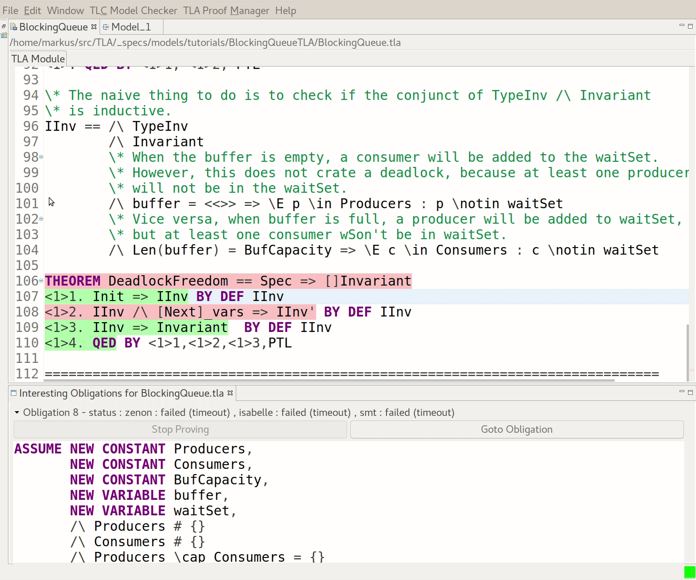

### v16 (TLAPS): Validating an inductive invariant candidate.

Finding an inductive invariant is hard!  Fortunately, we can use TLC to - little by little - find and validate potential inductive invariants.  Some deeper thinking is at play too though:

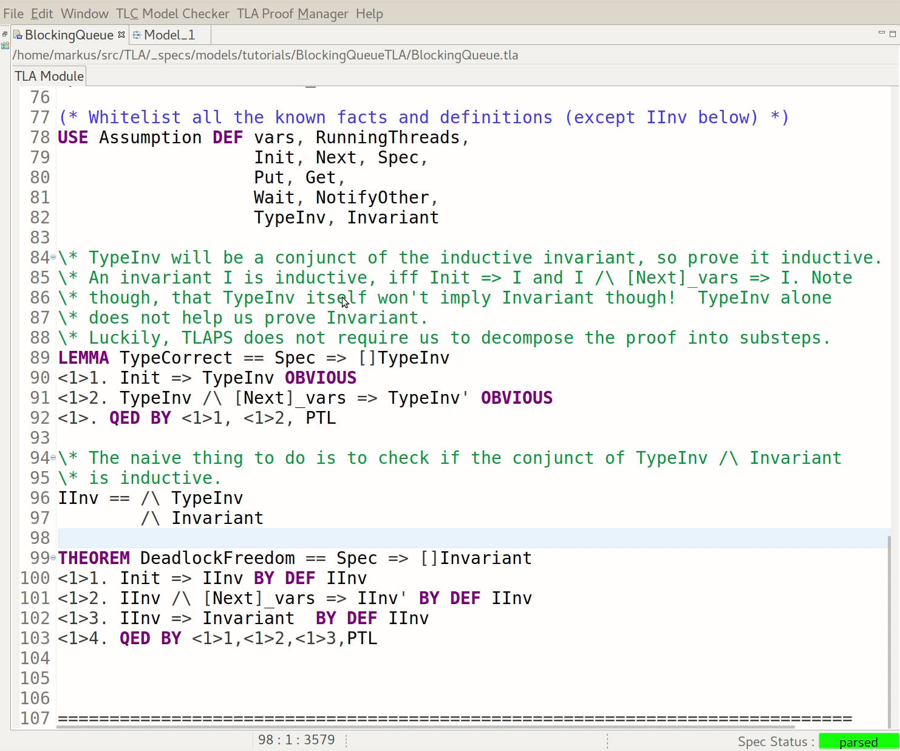

Note that we rewrite the last conjunct of ```TypeInv``` to ```\in SUBSET```.  Check
the [discussion group](http://discuss.tlapl.us/msg00619.html) for the technical reason why.  We also re-define the Seq operator because its definition in the Sequences 
standard module is not enumerable.  We only re-define Seq in BlockingQueue.tla because the vscode extensions doesn't have a model editor yet.  Generally though, we would do this in the model to not taint the actual spec.

### v15 (TLAPS): Finding the inductive invariant.

The previous step was easy and straight forward!  Now comes the hard part: Finding
the inductive invariant that implies deadlock freedom.

Unfortunately, naive approach does not work: 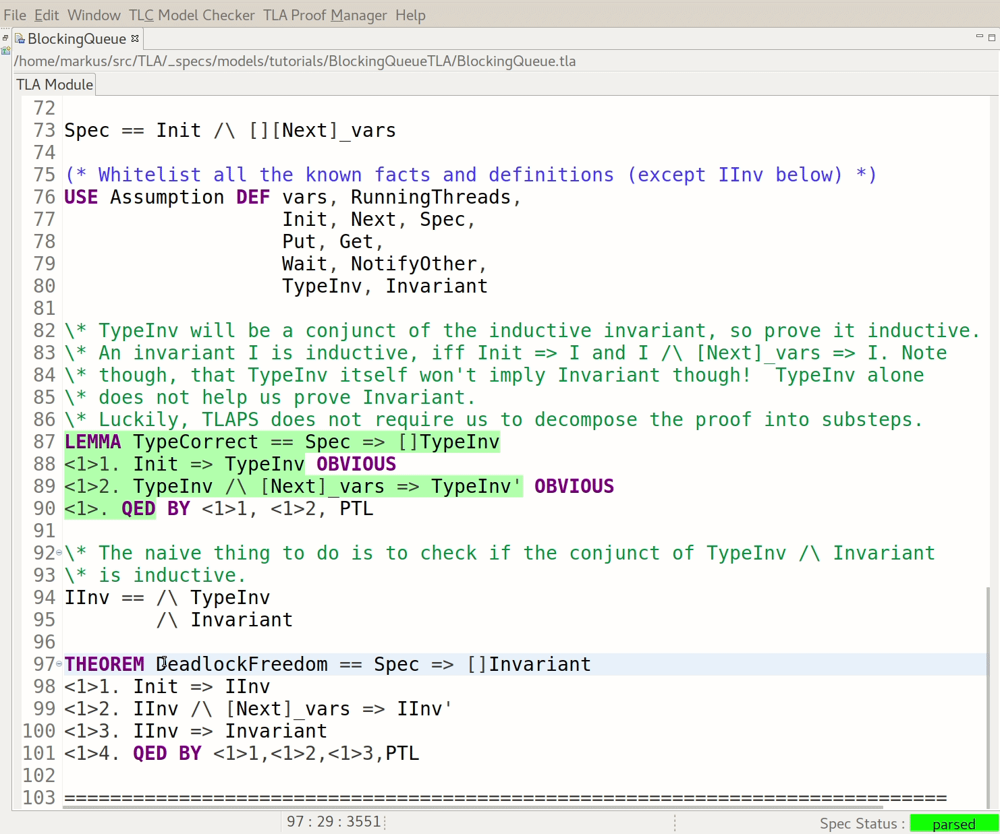

Invariant is not *inductive*, because ```Invariant /\ Next_vars => Invariant'``` does not
hold for e.g. the ```[buffer = <<>> /\ Wait(t)]_vars``` step (assum we are in the 
(unreachable) state with ```RunnintThreads = {t}```, the successor state will have
```RunningThreads' = {} /\ waitSet' = (Producers \cup Consumers)```.  A similar argument
applies to a ```[Len(buffer) = BufCapacity /\ Wait(t)]_vars``` step.

### v14 (TLAPS): Proof that TypeInv is inductive.

Recall that the deadlock originally only happened iff 
```2*BufCapacity < Cardinality(Producers \cup Consumers)```.  How do we know
that the solution with two mutexes hasn't a similar flaw, just for a different
inequation?  All the model-checking in the world won't gives us absolute
confidence, because the domains for Producers, Consumers, and BufCapacity are
infinite.  We have to prove that the solution with two mutexes is correct for all configurations no matter what values we chose for producer, consumer, or BufCapacity.

Here, we will use [TLAPS](https://tla.msr-inria.inria.fr/tlaps/content/Home.html) to take the first step towards an invariance proof of deadlock freedom by proving that ```TypeInv``` is inductive.  In the screencast below, TLAPS first checks the QED step,
then the 1<1> and 1<2> steps, and finally the top-level THEOREM.

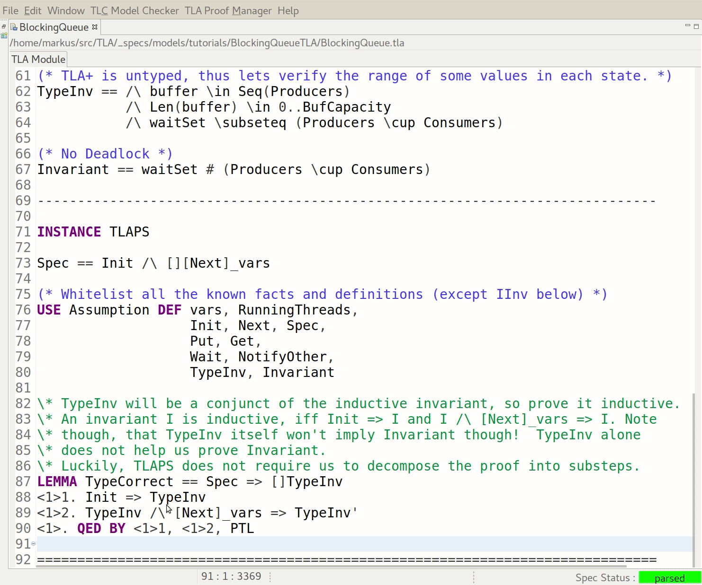

Note that this step and the following ones require the TLA+ Toolbox and TLAPS! If
you don't have the Toolbox or TLAPS, you can skip this part (TLAPS.tla has been added to this repository to avoid parser errors).

--------------------------------------------------------------------------

### v13 (Bugfix): (Logically) two mutexes.

Remove notifyAll and instead introduce two mutexes (one for Producers
and one for Consumers).  A Consumer will notify the subset of
Producers waiting on the Producer mutex (vice versa for a Producer).
    
The spec does not have to introduce two mutexes.  Instead, we can
just pick the right thread type from the set of waiting threads.
    
This fix completely solves the bug, but are we fully satisfied yet?

### v12 (Bugfix): Always notify all waiting threads.

Always notify all waiting threads instead of a non-deterministically
selected one.  This fixes the deadlock bug but at a price: Load will
spike when all (suspended) threads wake up at once.

As a bonus exercise, check if it necessary to notify all waiting threads in both ```Put``` and ```Get```.

Note that this is the proposed solution to the bug in [Challenge 14](http://wiki.c2.com/?ExtremeProgrammingChallengeFourteen) of the c2 extreme programming wiki.  To the best of my knowledge, not a single comment mentions that just one ```notifyAll``` suffices. Neither does anybody mention a more elegant fix that has no performance implications (see next step).

### v11 (Bugfix): Non-deterministically notify waiting threads.

Non-deterministically notify waiting threads in an attempt to
fix the deadlock situation.  This attempt fails because we
might end up waking the wrong thread up over and over again.

--------------------------------------------------------------------------

### v10 (Animation): Add visualization of error-traces.
    
The trace with 2 procs, 1 cons, and a buffer of length 1 is
minimal (length 8).  The other trace shows how quickly the
issue becomes a) incomprehensible and b) the length of the
trace increases (46 states for 7 threads).  TLC takes 75 secs
on my machine to check this.

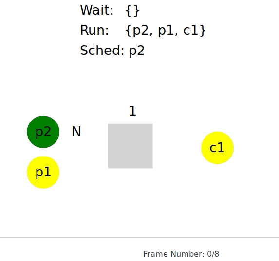

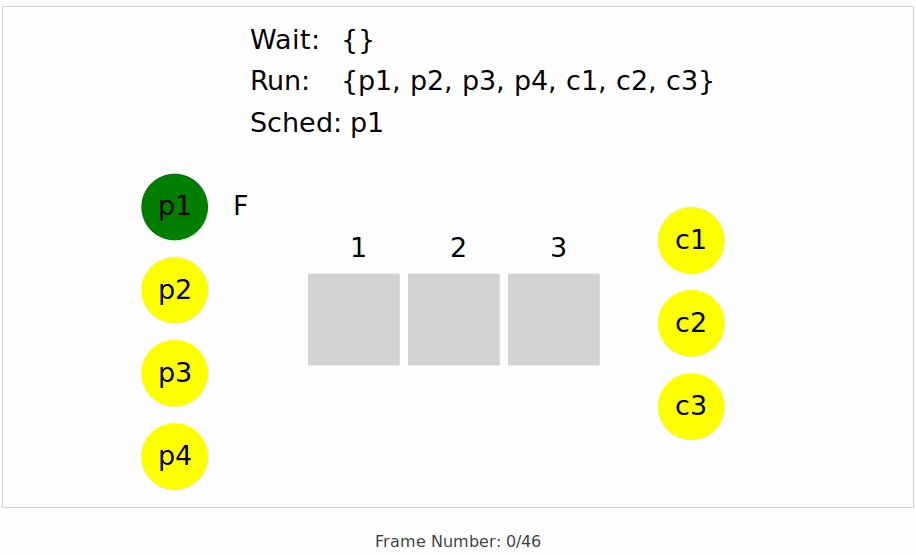

The animations are created in the Toolbox with:

1. Check model [BlockingQueue.cfg](BlockingQueue.cfg)
2. Set ```Animation``` as the trace expression in the Error-Trace console
3. Hit Explore and export/copy the resulting trace to clipboard
4. Paste into http://localhost:10996/files/animator.html

Without the Toolbox, something similar to this:

1. Check model [BlockingQueue.cfg](BlockingQueue.cfg) with ```java -jar tla2tools.jar -deadlock -generateSpecTE BlockingQueue``` ('-generateSpecTE' causes TLC to generate [SpecTE.tla](SpecTE.tla)/.cfg)
2. State trace expression ```Animation``` ([BlockingQueueAnim.tla](BlockingQueueAnim.tla))in SpecTE.tla
3. Download https://github.com/tlaplus/CommunityModules/releases/download/20200107.1/CommunityModules-202001070430.jar
4. Check SpecTE with ```java -jar tla2tools.jar:CommunityModules-202001070430.jar tlc2.TLC SpecTE```
5. Copy trace into http://localhost:10996/files/animator.html (minor format changes needed)

### v09 (Animation): Add prophecy variable to simplify animation.

The next-state relation has been restated to "predict"
the value of t (threads) in the successor state. We
will use the prophecy variable in the following
commit to come up with an animation.
    
This and the following commit can be skipped unless
you are interested in the more advanced concept of
prophecy (http://lamport.azurewebsites.net/pubs/auxiliary.pdf)
or animations (https://youtu.be/mLF220fPrP4).

--------------------------------------------------------------------------

### v08b (trace): Check configurations up to 20 processes and buffer capacity 10.

The state-space reduction due to the introduction of the view in the previous commits, allows TLC to check the spec for larger configurations, with which we can infer the error-trace length.

```bash
java -jar /opt/TLA+Toolbox/tla2tools.jar -deadlock -note SimBlockingQueue
```

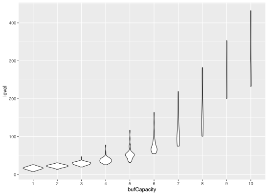

### v08a (view): Define a view that abstracts buffer into a counter.

We exploit the insight that the order of elements in the (fifo) buffer is irrelevant for the correctness of the algorithm.  In other words, we can abstract the buffer into a simple counter of elements.  With this abstraction, the state-space for the current config shrinks from 2940 to 1797 distinct states. 

### v08 (continue): Infer inequation under which the system is deadlock free.

Based on the scaffolding in the two previous steps, we run TLC with the [```-continue```](https://lamport.azurewebsites.net/tla/tlc-options.html?back-link=tools.html) option to not stop state space exploration after a violation of the invariant has been found.  In other words, we ask TLC to find all violations, not just one of the shortest ones (Breadth-First search guarantees that TLC finds the shortest counterexample first).

```bash
java -jar /opt/TLA+Toolbox/tla2tools.jar -deadlock -continue BlockingQueue | grep InvVio | sort | uniq
<<"InvVio", 1, 3>>
<<"InvVio", 1, 4>>
<<"InvVio", 1, 5>>
<<"InvVio", 1, 6>>
<<"InvVio", 1, 7>>
<<"InvVio", 1, 8>>
<<"InvVio", 2, 5>>
<<"InvVio", 2, 6>>
<<"InvVio", 2, 7>>
<<"InvVio", 2, 8>>
<<"InvVio", 3, 7>>
<<"InvVio", 3, 8>>
```

A little bit of bashery trims TLC's output so that we - with some squinting -  notice that ```BlockingQueue``` is deadlock free iff ```2*BufCapacity >= Cardinality(Producers \cup Consumers)```.  A simple [R plot](./R/ContinueInequation.R) makes this even more visible ('d' indicates a configuration that deadlocks):

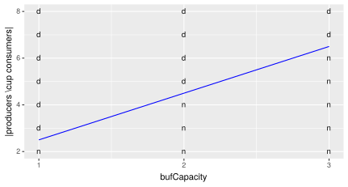

Collecting even more [data](./R/TraceLength.csv), we can [correlate](./R/TraceLength.R) the length of the error trace with the constants (```Cardinality(Producers)```, ```Cardinality(Consumers)```, ```BufCapacity```, and ```Cardinality(Producers \cup Consumers)```):

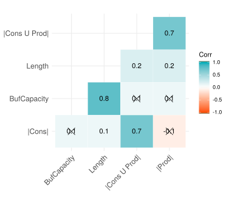 ([ggcorrplot](http://www.sthda.com/english/wiki/ggcorrplot-visualization-of-a-correlation-matrix-using-ggplot2))


### v07 (continue): Declare Producers and Consumers to be symmetry sets.

The sets ```Producers``` and ```Consumers``` are symmetry sets for the ```BlockingQueue``` specification, meaning that permuting the elements in the sets does not change whether or not a behavior satisfies that behavior spec.  TLC can take advantage of this to reduce the number of (distinct) states it has to examine from 57254 to 1647!

Note that TLC does not check if a set you declare to be a symmetry set really is one.  If you declare a set to be a symmetry set and it isn't, then TLC can fail to find an error that it otherwise would find.  An expression is symmetric for a set ```S``` if and only if interchanging any two values of ```S``` does not change the value of the expression.  The expression ```{{v1, v2}, {v1, v3}, {v2, v3}}``` is symmetric for the set ```{v1, v2, v3}``` -- for example, interchanging ```v1``` and ```v3``` in this expression produces ```{{v3, v2}, {v3, v1}, {v2, v1}}```, which is equal to the original expression.  You should declare a set S of model values to be a symmetry set only if the specification and all properties you are checking are symmetric for S after the substitutions for constants and defined operators specified by the model are made.  For example, you should not declare ```{v1, v2, v3}``` to be a symmetry set if the model substitutes v1 for some constant.  The only TLA+ operator that can produce a non-symmetric expression when applied to a symmetric expression is CHOOSE.  For example, the expression

```tla
CHOOSE x \in {v1, v2, v3} : TRUE
```

is not symmetric for ```{v1, v2, v3}```. 

Symmetry sets should not be used when checking liveness properties.  Doing so can make TLC fail to find errors, or to report nonexistent errors.  The Toolbox adds a warning to the model when you try this.

(The description of this step originates from https://tla.msr-inria.inria.fr/tlatoolbox/doc/model/model-values.html)

### v06 (continue): Convert constants into variables.

In the section ["Limitations of Model-Checking"](http://www.cs.unh.edu/~charpov/programming-tlabuffer.html), Michel Charpentier points out that ```BlockingQueue``` is deadlock-free under some configurations, but that model checking is not helpful with finding the underlying mathematical function.  This observation is true in general because we cannot ask TLC to compute the set of all configurations for which ```BlockingQueue``` is deadlock-free, but at least we can ask it to find as many data points as possible. From those data points, we can try to infer/learn the function.

In this step, we rewrite ```BlockingQueue``` to check multiple configurations instead of a single one (p1c2b1) at once. Note that the rewrite increases the complete state space to 57254 distinct states, but TLC continues to find the behavior shown in the previous step. This is because TLC - by default - explores the state space with [breadth-first search](https://en.wikipedia.org/wiki/Breadth-first_search). This [search mode](https://tla.msr-inria.inria.fr/tlatoolbox/doc/model/tlc-options-page.html#checking) guarantees to always find the shortest counterexample (if TLC runs ```-workers N``` with N > 1, it only returns the shortest counterexample with high probability).

We hope to [better support checking different constant values](https://github.com/tlaplus/tlaplus/issues/272) in the future.

--------------------------------------------------------------------------

### v05: Add Invariant to detect deadlocks.

Add Invariant to detect deadlocks (and TypeInv). TLC now finds the deadlock
for configuration p1c2b1 (see below) as well as the one matching the Java
app p4c3b3.

```tla
Error: Invariant Invariant is violated.
Error: The behavior up to this point is:
State 1: <Initial predicate>
/\ buffer = <<>>
/\ waitSet = {}

State 2: <Next line 52, col 9 to line 55, col 45 of module BlockingQueue>
/\ buffer = <<>>
/\ waitSet = {c1}

State 3: <Next line 52, col 9 to line 55, col 45 of module BlockingQueue>
/\ buffer = <<>>
/\ waitSet = {c1, c2}

State 4: <Next line 52, col 9 to line 55, col 45 of module BlockingQueue>
/\ buffer = <<p1>>
/\ waitSet = {c2}

State 5: <Next line 52, col 9 to line 55, col 45 of module BlockingQueue>
/\ buffer = <<p1>>
/\ waitSet = {p1, c2}

State 6: <Next line 52, col 9 to line 55, col 45 of module BlockingQueue>
/\ buffer = <<>>
/\ waitSet = {p1}

State 7: <Next line 52, col 9 to line 55, col 45 of module BlockingQueue>
/\ buffer = <<>>
/\ waitSet = {p1, c1}

State 8: <Next line 52, col 9 to line 55, col 45 of module BlockingQueue>
/\ buffer = <<>>
/\ waitSet = {p1, c1, c2}
```

Note that the Java app with p2c1b1 usually deadlocks only after it produced thousands of lines of log statements, which is considerably longer than the error trace above.  This makes it more difficult to understand the root cause of the deadlock.  For config p4c3b3, the C program has a high chance to deadlock after a few minutes and a couple million cycles of the consumer loop. 

Sidenote: Compare the complexity of the behavior described in [Challenge 14](http://wiki.c2.com/?ExtremeProgrammingChallengeFourteenTheBug) of the c2 extreme programming wiki for configuration p2c2b1 with the TLA+ behavior below.  The explanation in the wiki requires 15 steps, whereas - for p2c2b1 - TLC already finds a deadlock after 9 states (and two more after 11 states).

```tla
Invariant Invariant is violated.
The behavior up to this point is:
1: <Initial predicate>
/\ buffer = <<>>
/\ waitSet = {}
2: <Next line 53, col 9 to line 56, col 45 of module BlockingQueue>
/\ buffer = <<>>
/\ waitSet = {c2}
3: <Next line 53, col 9 to line 56, col 45 of module BlockingQueue>
/\ buffer = <<>>
/\ waitSet = {c1, c2}
4: <Next line 53, col 9 to line 56, col 45 of module BlockingQueue>
/\ buffer = <<p1>>
/\ waitSet = {c2}
5: <Next line 53, col 9 to line 56, col 45 of module BlockingQueue>
/\ buffer = <<p1>>
/\ waitSet = {p1, c2}
6: <Next line 53, col 9 to line 56, col 45 of module BlockingQueue>
/\ buffer = <<p1>>
/\ waitSet = {p1, p2, c2}
7: <Next line 53, col 9 to line 56, col 45 of module BlockingQueue>
/\ buffer = <<>>
/\ waitSet = {p1, p2}
8: <Next line 53, col 9 to line 56, col 45 of module BlockingQueue>
/\ buffer = <<>>
/\ waitSet = {p1, p2, c1}
9: <Next line 53, col 9 to line 56, col 45 of module BlockingQueue>
/\ buffer = <<>>
/\ waitSet = {p1, p2, c1, c2}
```

### v04: Debug state graph for configuration p2c1b1.
    
In the previous step, we looked at the graphical representation of the state
graph.  With the help of TLCExt!PickSuccessor we build us a debugger
with which we study the state graph interactively.  We learn that with
configuration p2c1b1 there are two deadlock states:

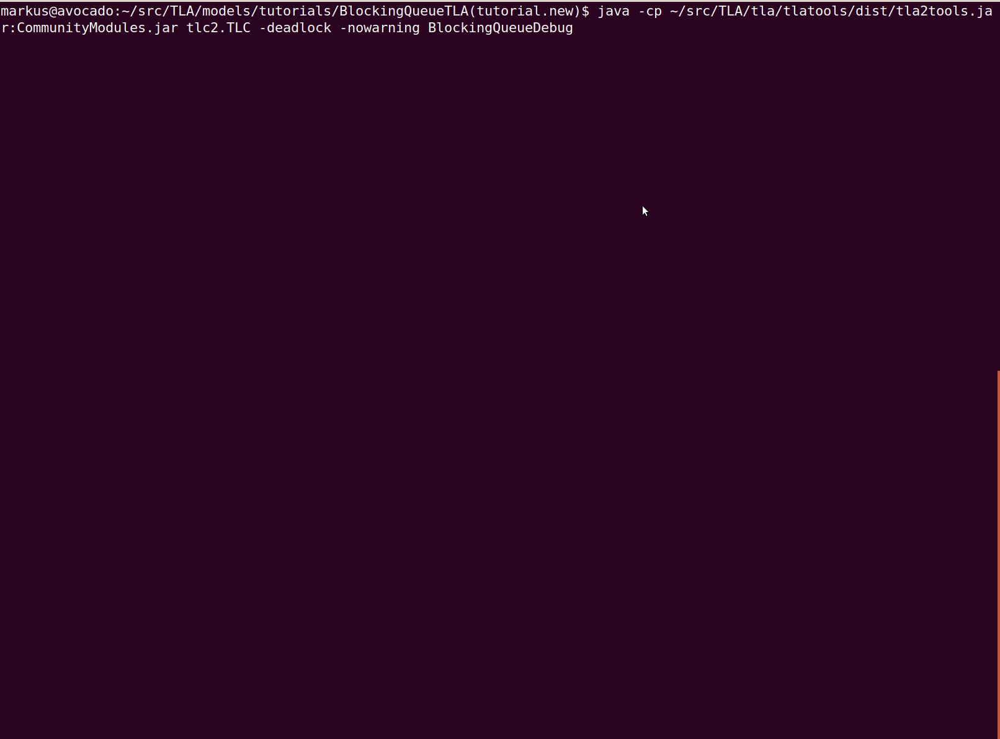

The [CommunityModules](https://github.com/tlaplus/CommunityModules) release has to be added to TLC's command-line:

```
java -cp tla2tools.jar:CommunityModules.jar tlc2.TLC -deadlock BlockingQueue
```

Note that TLC's ```-continue``` flag would have also worked to find both
deadlock states.

### v03: State graph for configurations p1c2b1 and p2c1b1.
    
Slightly larger configuration with which we can visually spot the
deadlock: 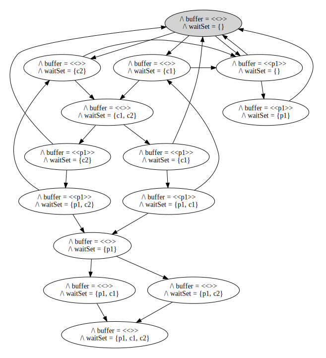.

BlockingQueueDebug.tla/.cfg shows how to interactively explore a
state graph for configuration p2c1b1 with TLC in combination with
GraphViz (xdot):

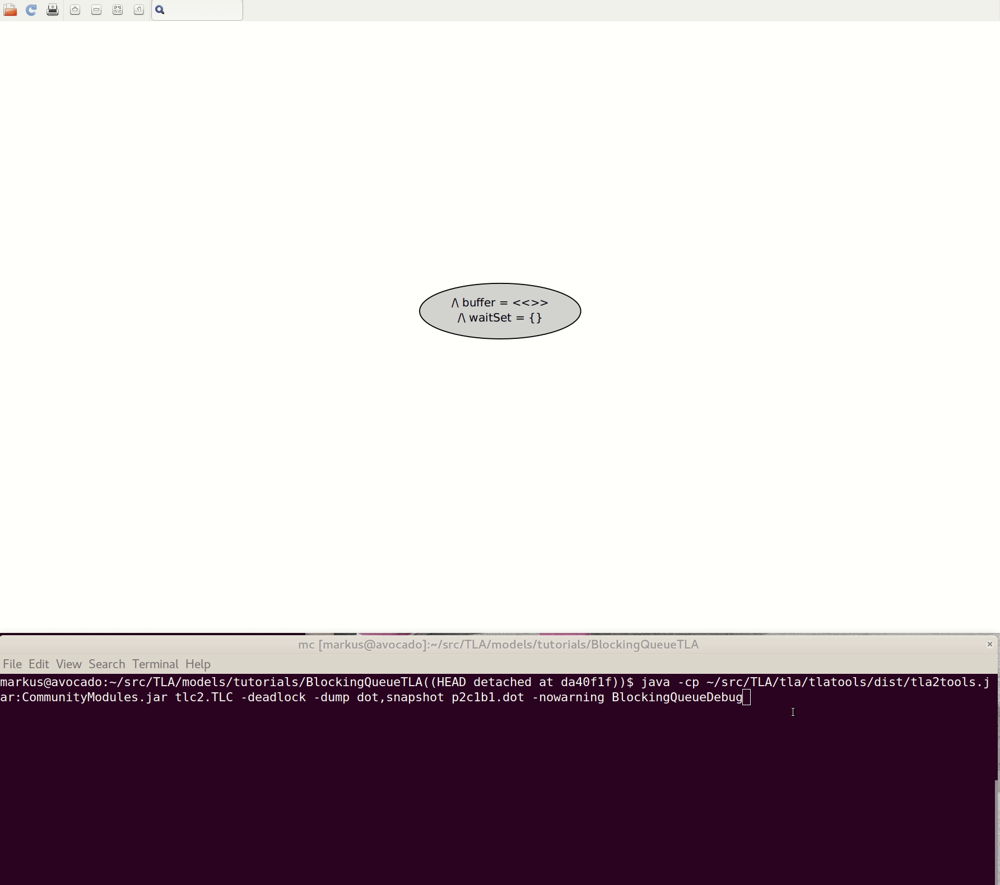

```
java -jar tla2tools.jar -deadlock -dump dot,snapshot p2c1b1.dot BlockingQueueDebug
```

### v02: State graph for minimum configuration p1c1b1.
    
Initial TLA+ spec that models the existing (Java) code with all its
bugs and shortcomings.
    
The model uses the minimal parameters (1 producer, 1 consumer, and
a buffer of size one) possible.  When TLC generates the state graph with
```java -jar tla2tools.jar -deadlock -dump dot p1c1b1.dot BlockingQueue```,
we can visually verify that no deadlock is possible with this
configuration: 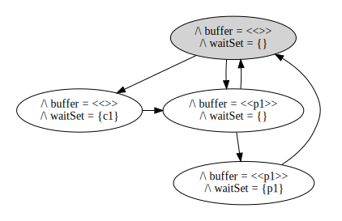.

### v01: Java and C implementations with configuration p4c3b3.
    
Legacy Java code with all its bugs and shortcomings.  At this point
in the tutorial, we only know that the code can exhibit a deadlock,
but we don't know why.
    
What we will do is play a game with the universe (non-determinism).
Launch the Java app with ```java -cp impl/src/ org.kuppe.App``` in
the background and follow along with the tutorial.  If the Java app
deadlocks before you finish the tutorial, the universe wins.

(For the c-affine among us, ```impl/producer_consumer.c``` is a C implementation of the blocking buffer sans most of the logging).

### v00: IDE setup, nothing to see here.
    
Add IDE setup for VSCode online and gitpod.io.
